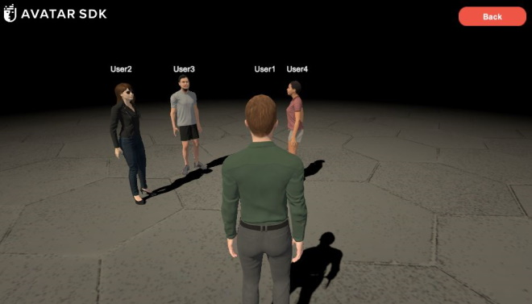

# MetaPerson - Photon Multiplayer Sample
This sample demonstrates how to use [MetaPerson](https://metaperson.avatarsdk.com/) avatars in unity multiplayer applications using [Photon](https://www.photonengine.com/pun) package.

### Requirements
- Unity 2021.3.19f1 or newer
- [Photon PUN 2 Free](https://assetstore.unity.com/packages/tools/network/pun-2-free-119922) or [Photon PUN 2+](https://assetstore.unity.com/packages/tools/network/photon-pun-2-120838) package.

## Getting Started
1. Clone this repository to your computer
2. Open the project in Unity 2021.3.19f1 or newer.
3. Import [Photon PUN 2 Free](https://assetstore.unity.com/packages/tools/network/pun-2-free-119922) or [Photon PUN 2+](https://assetstore.unity.com/packages/tools/network/photon-pun-2-120838) package and configure App PUN settings.
4. Add the following scenes into Build Settings and build a *Windows, Mac, Linux* app.
- `Assets/AvatarSDK/MetaPerson/PhotonSample/Scenes/LauncherScene.unity`
- `Assets/AvatarSDK/MetaPerson/PhotonSample/Scenes/GameScene.unity`
5. Run the built app as the first instance, enter user name, select an avatar and press *Play* button.
6. Run the `Assets/AvatarSDK/MetaPerson/PhotonSample/Scenes/LauncherScene.unity` scene in Unity, enter user name, select an avatar and press *Play* button. It is the second instance.

## How It Works
### LauncherScene
This scene represents a *Lobby*. Here you enter your user name and select an avatar.
- User name is stored in the *PlayerPrefs*.
- The DropDown control has an avatars list each of has its own link to a *GLB* file. This link is set in custom properties (`PhotonNetwork.SetPlayerCustomProperties`) and is used by [PlayerManager](./Assets/AvatarSDK/MetaPerson/PhotonSample/Scripts/PlayerManager.cs)
### GameScene
It is a room where avatars of connected users are shown. Once a new user enters the room, its avatar is being loaded from the provided link. The [MetaPerson Loader](https://github.com/avatarsdk/metaperson-loader-unity) package is used to load an avatar in *GLB* format at runtime.
### MetaPersonPhotonPrefab
It is a prefab that is instantiated for each player. This prefab is configured for template avatar model that is stored in assets. Initially the template model is shown for each player. Once the avatar model from the passed link is loaded, it replaces the template model.

## Support
If you have any questions or issues with the sample, please contact us <support@avatarsdk.com>.
