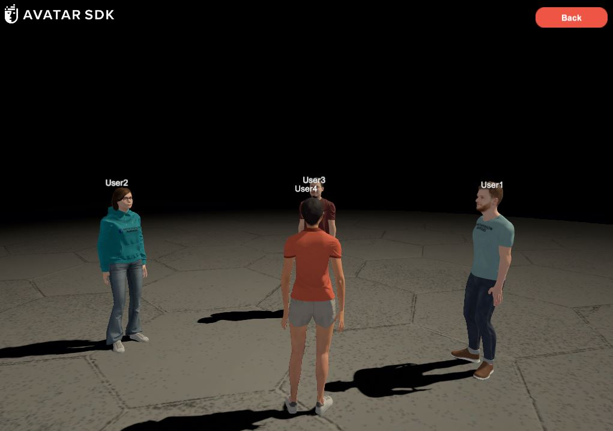

# MetaPerson - Photon Multiplayer Sample
This sample demonstrates how to use [MetaPerson](https://metaperson.avatarsdk.com/) avatars in unity multiplayer applications using [Photon Fusion](https://www.photonengine.com/fusion) package.



### Requirements
- Unity 2021.3.19f1 or newer
- [Photon Fusion SDK 2.0](https://www.photonengine.com/sdks#fusion)

## Getting Started
1. Clone this repository to your computer
2. Open the project in Unity 2021.3.19f1 or newer.
3. Import [Photon Fusion SDK 2.0](https://doc.photonengine.com/fusion/current/getting-started/sdk-download) package and configure Fusion App Id in Photon Hub window.
4. Add the following scenes into Build Settings and build a *Windows, Mac, Linux* app.
- `Assets/AvatarSDK/MetaPerson/PhotonSample/Scenes/LauncherScene.unity`
- `Assets/AvatarSDK/MetaPerson/PhotonSample/Scenes/GameScene.unity`
5. Run the built app as the first instance, enter user name, select an avatar and press *Play* button.
6. Run the `Assets/AvatarSDK/MetaPerson/PhotonSample/Scenes/LauncherScene.unity` scene in Unity, enter user name, select an avatar and press *Play* button. It is the second instance.

## How It Works

### LauncherScene
The **LauncherScene** is the initial scene where users:
- Enter their username.
- Select an avatar.

The following data is stored in **PlayerPrefs(* and passed to the **GameScene**:
- **Username** – The entered player name.
- **Avatar GLB File** – A link to the selected avatar's GLB model.
- **Avatar Gender** – The gender of the chosen avatar.

### GameScene
This scene includes the core multiplayer setup with the following key objects:

1. Prototype Network Start
- Operates in **Shared Authority** mode, enabling collaborative interactions between connected players.
- Handles initial network synchronization and session management.


2. Prototype Runner
- Contains a **Player Spawner** component responsible for instantiating **MetaPerson prefabs** upon player connection.
- The spawned prefabs are configured with the avatar data (username, GLB model, gender) passed from **LauncherScene**.

### PlayerSpawner
Spawns player avatars in multiplayer sessions.
- Instantiates gender-specific prefabs (male/female)
- Loads avatar data from `PlayerPrefs`:
  - Model URL
  - Gender
  - Display name
- Random circular spawn pattern (2m radius)

### MetaPerson Photon Prefab
An object instantiated for each player, with separate prefabs for male and female avatars.

- **Meta Person Loader**: Uses the [MetaPerson Loader](https://github.com/avatarsdk/metaperson-loader-unity) package to load GLB models.
- **Meta Person Material Generator**: Provides material templates for avatar customization.
- **Network Object**: Gives the object a network identity for multiplayer synchronization.
- **Network Transform**: Synchronizes the object's position across all connected clients.
- **MetaPerson Loader Network**: Extends avatar loading functionality for multiplayer environments.
- **Player Movemet Controller**: Handles movement input and animation synchronization.
- **Camera Controller**: Adjusts the camera position based on the avatar's movement.
- **Animator**: Controls the avatar's animation states and transitions.

### MetaPerson Loader Network

Initially a template model is shown on the scene. This component downloads an avatar model from the provided URL, loads it into the scene, and replaces the template avatar.

- The GLB model link is set via the `AvatarURL` network-synchronized property.

```cs
[Networked, Capacity(128)]
public string AvatarURL { get; set; }
```

- `MetaPerson Loader` is used to to fetch and prepare the GLB model.

```cs
GameObject loadedAvatarObject = new GameObject("Loaded Avatar");
metaPersonLoader.avatarObject = loadedAvatarObject;
metaPersonLoader.avatarObject.SetActive(false);
bool isAvatarLoaded = await metaPersonLoader.LoadModelAsync(avatarLink);
```

- Once the avatar model is ready, swaps the template with the loaded model.

```cs
MetaPersonUtils.ReplaceAvatar(metaPersonLoader.avatarObject, gameObject);
```

### Player Movement Controller

Controls character movement and animation synchronization.

- Press **Up Arrow** or **W** to move forward. 
- Automatically switches from **Idle** to **Walk** animation.
- Animation state is synchronized across players via the `AnimationStateName` networked property.

### Camera Controller

Makes the camera follow the player's character with mouse-controlled rotation.

- Automatically follows the player character.
- **Left mouse button + drag** rotates the camera.


## Integration MetaPerson Creator Into App
The *AvatarSelectionScene* scene demonstrates how to integrate the [MetaPerson Creator](https://metaperson.avatarsdk.com/) web page into your application for creating new avatars or customizing already created.
You can scroll through the sample avatars, find a slot with the custom avatar and click on the *Create My Avatar* button.

The communications between [MetaPerson Creator](https://metaperson.avatarsdk.com/iframe.html) and Unity are performed via [JS API](https://docs.metaperson.avatarsdk.com/js_api.html).


### AvatarSelectionScene Configuration
1. Import [Vuplex plugin for Windows and macOS](https://store.vuplex.com/webview/windows-mac) into the project. This plugin is required to show [MetaPerson Creator](https://metaperson.avatarsdk.com/) web page inside a unity application. We can provide you with a **20% discount** coupon for this plugin. Please contact us <support@avatarsdk.com> to get it.
2. Find the *SceneHandler* object and provide your [Account Credentials](#account-credentials).

3. Add `Assets/AvatarSDK/MetaPerson/PhotonSample/Scenes/AvatarSelectionScene.unity` into Build Settings.

## Support
If you have any questions or issues with the sample, please contact us <support@avatarsdk.com>.
